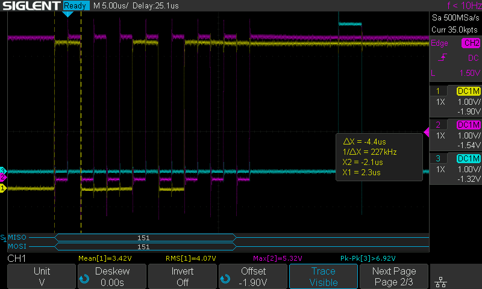
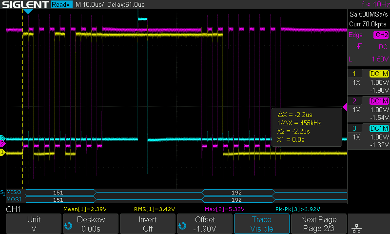
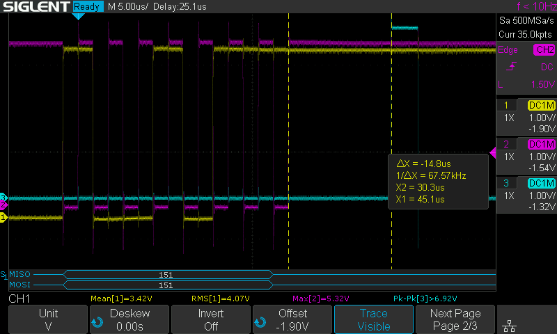
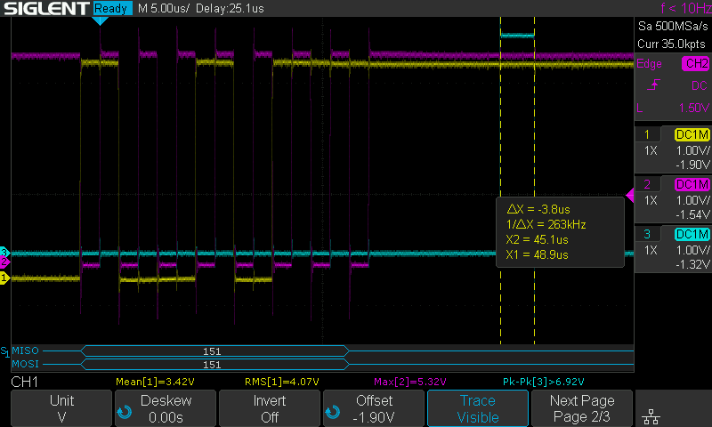

# Arduino CTCSS (de)coder for Icom IC-275

## Description:
With this code, I try to attempted to program a Arduino nano, to use in older transceivers, where the CTCCC board is no longer available. 
The goal is to let the Arduino communicate with the transceiver, as it would with a factory CTCSS board. 
I found out that Icom, yaesu, and Kenwood, all use a 8 bit shift register IC, and a CTCSS encoder/decoder IC like the FX365, that are obsolete.

## acknowledgment
I used the library written by PE1CID,that I slightly modified, to generate the sub-audio tone. (CtcssTone)

## Pins used: 
PIN 2 = ChipSelect Input for TSTB from the transceiver 
PIN 3 = PWM_OUTPUT output that generates the sub-audio tone 
PIN 4 = PTT_INDICATOR output indicator with led -for testing purposes 
PIN 5 = TONE_OFF_INDICATOR output indicator with led for testing purposes 
PIN 8 = DECODE_INDICATOR goes high if CTCSS code is decoded 
PIN 11 = MOSI SPI DATA from transceiver 
PIN 13 = SCK SPI clock serial clock for CK from transceiver 
PIN 14 = A0 Sub-audio tone input, needs 260Hz lowpass filter

## Serial data from transceiver
Clock period (Fig1) = 4.4 uSec 
Data Pulse (Fig2) = 2.2 uSec. 
Latch after last clock pulse (Fig3) = 14.8 uSec. 
Latch time (Fig4) = 3.8 µSec. 
Latch to next bust of always 192 (Fig5) = 22.2 uSec.

### Fig 1

### Fig 2

### Fig 3

### Fig 4

### Fig 5

